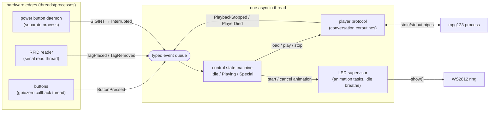
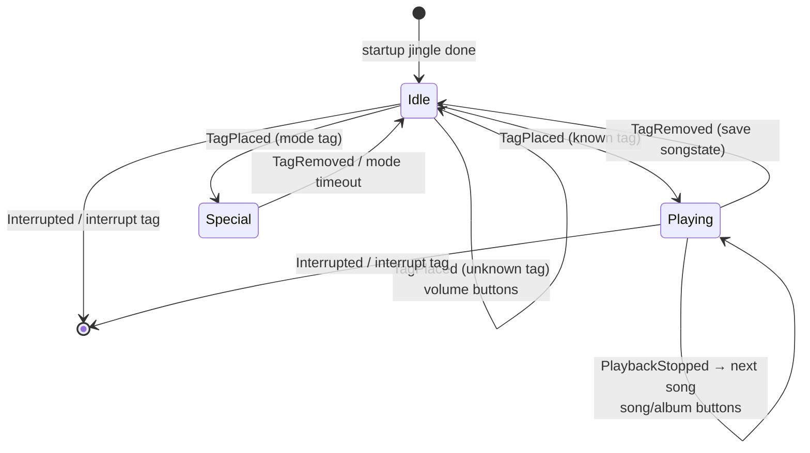

# Marta redesign

Status: draft for discussion — nothing in here is implemented yet.
Scope of this document: the full target picture in brief, then **stages 1+2 in
detail**, which is what we build next.

## Why

The inherited architecture is five threads (main loop, mpg123 reader, RFID
reader, LED controller, gpiozero callbacks) sharing one untyped queue and
mutable module state. Nearly every bug fixed during the 2to3 stabilization
traces to one of its seams:

- untyped `[int, *params]` events + if/elif dispatch (three places to touch
  per new event)
- magic handler return values (`None` / `-1` / seconds / `TIMEOUT_NEVER`)
- a player wrapper whose "response arrived" event does not know *which*
  command a reply answers (the `@I` desync class)
- module-level globals (`Buttons`, `TAG_TO_DIR` — mutated at runtime for album
  rotation), singletons with back-references, `environ["MARTA"]` at import
  time — which is why the actual brain (`MusicHandler`) has no tests
- no timers, no packaging, config constants scattered over six files

## Hard compatibility constraints (all stages)

These do not change, ever, without a separate decision:

- `audio/` directory layout, tag-suffix naming convention, `.albumindicator`
  and `.songstate` file formats (the existing library must keep working)
- systemd boot behavior: early start, sound-card wait, restart policy,
  exit code 2 = debug exit stays a "success" status
- `power_button_daemon.py` remains a separate watchdog process
- user-visible behavior: jingle, LED language (breathe = idle, dark =
  playing), button mapping, special tags

## Target picture (stages 3–5, summary only)

- Stage 3: split `MusicHandler` into `library.py` (pure tag→album scan +
  songstate persistence, unit-tested) and an explicit state machine
  (`Idle` / `Playing` / special modes) — this is where "intuitive" happens.
- Stage 4: swap the threaded core for an asyncio event loop. Hardware stays
  behind thread adapters bridging via `call_soon_threadsafe`; animations
  become cancellable tasks (replaces `SleepInterruptedException` + the sticky
  breathe flag machinery); timers become native (progress dot ≈ 10 lines).
- Stage 5: rebuild the mpg123 protocol layer with request↔response matching
  (each command returns a future resolved by its own reply); evaluate
  `mpv --no-video` + JSON IPC only if that still feels fragile.

Each stage lands on a deployable, on-device-verified state before the next
begins.

## Why coroutines under the state machines (decision record)

The system's abstract model is several state machines passing messages
(control, audio, light). The question was the execution substrate: threads
(status quo), one flat event machine dispatching from main, or coroutines.
The decision — coroutines under an explicit control machine — rests on one
observation:

> A coroutine **is** a state machine whose states are generated by the
> compiler: the `await` points are the states, the straight-line code is the
> transition table (Lauer–Needham duality).

Where states are *few and semantic* (Idle / Playing / Special), an explicit
flat machine is clearer — the control layer stays one. Where states are
*many and incidental* — the 8-step mpg123 load conversation, animation
scripts of the form "set LEDs, wait 50 ms, repeat" — hand-written states are
noise, and the legacy code proves it empirically: `MPG123._command` *blocks
the main thread* to avoid writing those states, and `LEDStrip._sleep` raises
`SleepInterruptedException` carrying the next message — a hand-rolled
coroutine yield. Both were the source of this project's hardest bugs
(the `@I` protocol desync; the breathe/volume animation fight).

What asyncio costs, accepted knowingly: reentrancy becomes explicit (an
event arriving mid-conversation needs a decided policy instead of implicit
blocking-serialization — which only ever moved the races to the boundaries,
cf. `expected_stop`), and debugging style changes. In exchange, two of five
threads disappear outright (mpg123 pipes via `asyncio.subprocess`, LED
rendering in-loop — `show()` is a ~1 ms C call), cancellation and timers
come from the runtime, and all logic runs on one thread that cannot race
itself.

### Target component picture



### Control state machine (the only hand-written one)



LED language, unchanged: breathing = Idle, dark = Playing, animations are
transient overlays that never outlive their state.

---

## Stage 1 — packaging and tooling (zero behavior change)

**Status: shipped** (`Add redesign doc and stage 1...`, `Make the offline
tests pytest-discoverable`).

Goal: the repo becomes a normal Python project; nothing observable changes on
the box.

- `pyproject.toml` at the repo root:
  - project `marta`, `requires-python = ">=3.11"` (Pi venv is 3.12)
  - runtime deps: `gpiozero`, `pyserial`, `rpi-ws281x` (see open question 3),
    `psutil` (power daemon)
  - dev deps: `pytest`, `ruff`, `mypy`
- `marta/` becomes a package (`__init__.py`), entry point `python -m marta`
  (`__main__.py` calling the existing `main()`); `Marta.py` keeps working
  during the transition. Transitional wart, removed in stage 2: the legacy
  modules import each other flat (`import Buttons`), so `__main__.py` puts
  the package directory on `sys.path` before importing — proper relative
  imports land together with the stage-2 renames.
- Tests become pytest-discoverable: wrap the existing script bodies of
  `tests/test_mpg123.py`, `tests/test_rfid.py`, `tests/test_ledstrip.py` in
  test functions; the fakes stay as they are. `sys.path` hacks replaced by an
  editable install (`pip install -e .`) or pytest `pythonpath` config.
- `ruff` (lint + format) and `mypy` in permissive mode (`ignore_errors` per
  legacy module, tightened per file as later stages touch them).
- CI substitute: a `make check` / script that runs ruff + mypy + pytest —
  the same command gates every later stage.

Deployment impact: none required immediately (`Marta.py` still runs by path).
The unit's `ExecStart` moves to `python -m marta` at the *end* of stage 2,
when the entry point is final — one unit change, not two. Remember the
`/etc/systemd/system/marta.service` symlink lesson: verify with
`systemctl cat` after every unit deploy.

## Stage 2 — typed events, config, dependency injection (same threading model)

**Status: shipped and verified on-device (2026-08-09).** See "What actually
shipped" below for where implementation deviated from this plan.

Goal: the code becomes explicit and injectable while keeping the proven
thread/queue engine. No asyncio, no `MusicHandler` split, no player changes.

### Events (`marta/events.py`)

Frozen dataclasses on the existing single queue, replacing `[int, *params]`:

```python
class Button(Enum):          # replaces raw BCM pin ints in app logic
    YELLOW = 5; BLUE = 6; RED = 13; GREEN = 26

@dataclass(frozen=True)
class ButtonPressed:   button: Button; millis: int
@dataclass(frozen=True)
class TagPlaced:       tag: str
@dataclass(frozen=True)
class TagRemoved:      pass
@dataclass(frozen=True)
class PlaybackStopped: pass
@dataclass(frozen=True)
class PlayerDied:      pass
@dataclass(frozen=True)
class Interrupted:     pass   # SIGINT / power button
```

The RFID adapter translates the reader's `tag / None` alternation into
`TagPlaced` / `TagRemoved` at the edge — `None` stops being a magic value
inside app logic. Dispatch in the main loop becomes a single
`match event:` — the `EVENT_HUMAN_READABLE` tables die (dataclass repr is
the log line).

### Handler contract (`marta/handler.py`)

Magic return values become a small explicit vocabulary, same semantics:

```python
@dataclass(frozen=True)
class Timeout:  seconds: float          # arm/replace the deadline
class Never:    ...                     # no deadline (replaces TIMEOUT_NEVER)
class Done:     ...                     # handler finished, back to default
# returning None still means "leave the deadline unchanged"
```

The loop consumes `Timeout | Never | Done | None`. Behavior is identical;
`TIMEOUT_NEVER = 10 years` disappears.

### Config (`marta/config.py`)

One frozen dataclass holding everything currently scattered: base dir
(resolved in `main()`, not at import), audio paths, pins, volume/pitch/
brightness scales, breathe parameters, special tag IDs, mpg123 binary +
timeouts, serial port settings. Defaults in code; base dir from `$MARTA` as
today. (TOML file support is a later nicety, not stage 2.)

### Composition root and adapters

`main()` builds: `Config` → queue → hardware adapters → handlers → loop.

- `Buttons.py` module globals → `class ButtonInput` (constructed with pins +
  a `post` callable). Same gpiozero usage inside.
- `RFIDReader`, `MPG123Player`, `LEDStrip` keep their internals but take a
  `post: Callable[[Event], None]` instead of ad-hoc lambdas, and stop being
  constructed inside `Marta.__init__`'s body mixed with boot choreography —
  construction happens in `main()`, the jingle choreography becomes its own
  function.
- Handler singletons (`get_instance`) die: handlers are constructed once in
  `main()` with exactly the dependencies they use (`player`, `leds`,
  `library`, `config`) instead of a `marta` back-reference. The
  special-tag → handler mapping moves into `Config`.
- `TagToDir`'s `exit(1)` calls become raised exceptions; the module-level
  `TAG_TO_DIR` dict becomes state owned by the (future) library object — in
  stage 2 it merely stops being import-time global.

### File map after stage 2 (as shipped)

| before stage 2         | after stage 2                      |
|------------------------|------------------------------------|
| `Marta.py`             | `loop.py` (`Marta` class) + `__main__.py` (composition root) |
| `MartaHandler.py`      | `handler.py` (`Handler` + `Timeout`/`Never`/`Done`) |
| `MusicHandler.py`      | `music_handler.py` (business logic bodies unchanged; construction/config plumbing rewired — see deviations) |
| `MPG123.py`            | `player.py` (protocol logic untouched; `post` callable + explicit `mpg123_binary` arg) |
| `RFIDReader.py`        | `rfid.py` (frame parsing untouched; `post` callable, constructs typed events itself) |
| `Buttons.py`           | `buttons.py` (class-ified: `ButtonInput`) |
| `LEDStrip.py`          | `ledstrip.py` (untouched but for the import line) |
| `TagToDir.py`          | `tag_to_dir.py` (the one `exit(1)` in library code → raise) |
| `ButtonLightHandler.py`, `RainbowHandler.py` | `button_light_handler.py`, `rainbow_handler.py` (constructor injection, singleton dropped) |
| `MPU.py`, `SetupLogging.py`, `Util.py` | `mpu.py`, `logging_setup.py`, `util.py` (renamed, untouched otherwise) |
| `TagToHandler.py`      | **deleted** — mapping now built in `__main__.py`'s `build_marta()` from `Config`'s tag fields |
| `neopixel.py`          | unchanged (revisit in stage 4) |
| —                      | `events.py`, `config.py` (new) |

### What actually shipped differently from the plan above

- **Imports are `from marta.x import y` (absolute, package-qualified), not
  relative (`from .x import y`)**. Relative imports would break every
  module's standalone `python -m marta.x` demo entry point (`if __name__ ==
  "__main__"` with a relative import fails outside package context);
  absolute imports work both via `-m marta` and standalone, relying on the
  stage-1 editable install (`pip install -e .`) making `marta` resolve from
  anywhere. This is what finally let stage 1's `sys.path.insert` shim in
  `__main__.py` go away, as promised.
- **`Config` ended up narrower than "pins" implied.** Button GPIO pins stay
  baked into `events.Button`'s enum values (matching this doc's own
  `events.py` sketch above) rather than being duplicated in `Config`; LED
  strip hardware parameters (pin, DMA channel, frequency...) stay in
  `ledstrip.py`. Both are fixed by the PCB, not meaningfully "deployment
  config" — only paths, tunable scales, breathe timing, special tag IDs,
  the mpg123 binary and serial port settings ended up in `Config`.
- **`music_handler.py` needed more than construction-plumbing changes** to
  actually fix the "`$MARTA` read at import time" complaint from this doc's
  Why section: `SONG_DIR`/`UNKNOWN_TAG_FILE`/the volume-pitch-brightness
  scales moved to injected `Config` fields (matching what this doc's Config
  section explicitly listed), not just the `player`/`leds` dependencies.
  The actual playback/album/volume *logic* — every method body — is
  unchanged.
- **`SHORT_TIMEOUT`/`LONG_TIMEOUT` are gone, not renamed.** An earlier
  session already made both equal (`TIMEOUT_NEVER`) to stop the box exiting
  on idle; since they'd become the same value under two names, call sites
  now just `return Never()` directly rather than carrying forward two names
  for one meaning.
- **Added `tests/test_loop.py`**, not in the original stage-2 scope, because
  the message-loop rewrite (the `if/elif` → two-phase `match` translation)
  was the highest-risk part of this stage and had zero coverage otherwise.
  It runs against fake handlers, no hardware — and caught a bug in its own
  first draft (a test-timing mistake, not a `loop.py` bug) before catching
  anything real.
- **`power_button_daemon.py` needed a fix, not just the units.** Its
  `is_marta_running()` matched `'Marta.py'` as a cmdline substring; under
  `python -m marta` that string never appears, which would have silently
  broken graceful shutdown. Now matches the exact `-m marta` argv tail.
- **`scripts/marta_startup.sh` is now stale** (references the deleted
  `Marta.py`, and encodes the old idle-exit-triggers-shutdown behavior this
  project moved away from). Nothing in the systemd-based deploy invokes it —
  left as-is rather than silently deleted; worth a decision whether to
  delete or repair it.

### Verification gate for stage 2 — all done, stage 2 is complete

1. ~~`make check` green~~ **done** (ruff, mypy, pytest incl. the three
   hardware fakes plus `test_loop.py`).
2. ~~On-device checklist~~ **done** — clean restart, jingle played, confirmed
   working on the real box (2026-08-09). One deploy-only issue surfaced and
   was fixed along the way: the fresh venv at the new location had no
   gpiozero pin-factory backend, so it fell back to gpiozero's legacy
   sysfs-based `NativeFactory`, which doesn't work on current Raspberry Pi
   OS kernels (`OSError` exporting `/sys/class/gpio/gpio5`). Fixed by adding
   `lgpio` as an explicit ARM-gated dependency (confirmed via the old venv's
   `pip list` that lgpio was what actually backed gpiozero there).
3. ~~Unit switched to `python -m marta`~~ **done**, deployed and verified.

## Risks and rollback

- Work happens on a branch off the known-good `2to3` head; the Pi can be
  rolled back to any commit with the usual rsync (plus unit re-point if past
  the ExecStart switch).
- Biggest stage-2 risk is subtle behavior drift while mechanizing dispatch —
  mitigated by keeping the loop's control flow line-for-line recognizable and
  by the on-device checklist.
- Renames make `git blame` noisier; accepted cost, done in a dedicated
  commit so content changes stay reviewable.

## Open questions (resolved)

1. **Venv location**: deferred to the end of stage 2 as recommended, bundled
   with the `ExecStart` switch — one coordinated unit edit, done. The Pi-side
   move (recreate `/home/jan/mmm/env`, `pip install` the package into it)
   still needs to happen as part of the not-yet-run deploy.
2. **Rename appetite**: renamed now (snake_case), as recommended.
3. **`rpi-ws281x` from PyPI vs vendored `neopixel.py`**: left vendored, as
   proposed. Revisit in stage 4.
4. **Power daemon**: left standalone, as recommended. `power_button_daemon.py`
   did need a small fix this stage regardless (see deviations above) — its
   independence from the package didn't mean independence from the rename's
   consequences.
